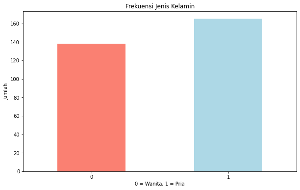
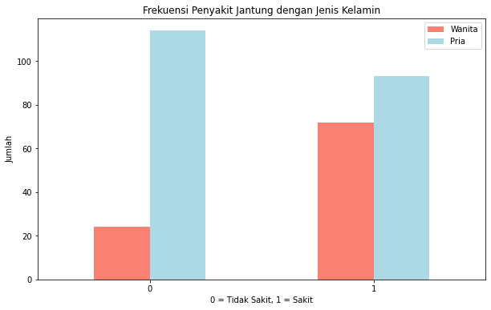
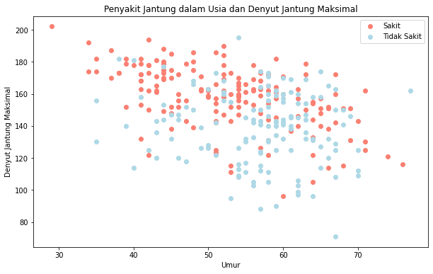
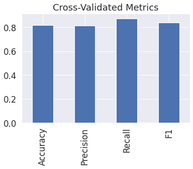

# Laporan Proyek Machine Learning

### Nama : M Daffa Alfikri

### Nim : 211351076

### Kelas : Pagi A

## Domain Proyek

Proyek ini dapat digunakan untuk mengidentifikasi tingkat risiko seseorang terkena penyakit jantung berdasarkan faktor-faktor seperti usia, jenis kelamin, riwayat keluarga, tekanan darah, profil lipid, dan Mengidentifikasi mengklasifikasikan berbagai jenis penyakit jantung bawaan pada anak-anak atau orang dewasa.

## Business Understanding

Bisa mengecek tekanan jantung dan darah sebaginya.

### Problem Statements

- Dalam kasus ini, masalah yang saya jelajahi adalah masalah klasifikasi biner.

Saya akan mencari informasi dan memprediksi apakah seseorang memiliki penyakit jantung atau tidak.

### Goals

- Menemukan Klasifikasi dan infromasi penyakit jantung seseorang terdapat atau tidak.

### Solution statements

- age - Usia dalam tahun
- sex - (1 = male; 0 = female)
- cp - chest pain type
- 0: Typical angina: nyeri dada terkait mengurangi suplai darah ke jantung
- 1: Atypical angina: nyeri dada tidak berhubungan dengan jantung
- 2: Non-anginal pain: biasanya kejang esofagus (tidak berhubungan dengan jantung)
- 3: Asymptomatic: nyeri dada tidak menunjukkan tanda-tanda penyakit
- trestbps - mengistirahatkan tekanan darah (dalam mm Hg saat masuk ke rumah sakit di atas 130-140 biasanya memprihatinkan)
- chol - serum cholestoral dalam mg/dl
  serum = LDL + HDL + .2 \* triglycerides
  di atas 200 yang memprihatinkan
  fbs - (fasting blood sugar > 120 mg/dl) (1 = true; 0 = false)
  '>126' mg/dL signals diabetes
- Model yang dihasilkan dari datasets itu menggunakan metode LinearRegression/KKN/Bine/EDA

## Data Understanding

Data asli berasal dari database Cleveland dari UCI Machine Learning Repository.

Database asli berisi 76 atribut, tetapi di sini hanya 14 atribut yang akan digunakan, atribut juga disebut fitur.

Atribut dan fitur juga disebut sebagai variabel bebas dan variabel terikat, saya menggunakan variabel bebas untuk memprediksi variabel terikat.

Dalam data ini, variabel bebas adalah atribut informasi pasien dan variabel terikat adalah apakah mereka memiliki penyakit jantung atau tidak....

<br>
[Klasifikasi Penyakit Jantung] (https://www.kaggle.com/datasets/dharanireddy/heart-disease).

### Variabel-variabel pada Klasifikasi Penyakit Jantung adalah sebagai berikut:

- Age : Masukan umur
- Sex : Masukan Gender,laki laki (Input1),perempuan (Input2)
- Cp : Masukan atypical angina: nyeri dada tidak berhubungan dengan jantung
- Trestbps : Masukan chest pain type
- Chol : Masukan tekanan darah
- Fbs : Masukan nomer serum cholestoral dalam mg/dl
- Restecg : Masukan fasting blood suga
- Thalach : Masukan sinyal detak jantung yang tidak norma
- Exang : Masukan denyut jantung maksimum tercapai
- Oldpeak : Masukan diinduksi angina
- Slope : Masukan Depresi ST
- Ca : Masukan jumlah pembuluh darah utama
- Thal : Masukan hasil stres thalium

## Data Preparation

### Data Collection

Untuk data collection ini, saya mendapatkan dataset yang nantinya digunakan dari website kaggle dengan nama dataset Klasifikasi Jantung, jika anda tertarik dengan datasetnya, anda bisa click link diatas.

### Data Discovery And Profiling

Untuk bagian ini, kita akan menggunakan teknik EDA. <br>
Pertama kita mengimport semua library yang dibutuhkan,

```bash
import numpy as np
import pandas as pd
import matplotlib.pyplot as plt
import seaborn as sns
```

Karena kita menggunakan google colab untuk mengerjakannya maka kita akan import files juga,

```bash
from google.colab import files
```

Lalu mengupload token kaggle agar nanti bisa mendownload sebuah dataset dari kaggle melalui google colab

```bash
file.upload()
```

Setelah mengupload filenya, maka kita akan lanjut dengan membuat sebuah folder untuk menyimpan file kaggle.json yang sudah diupload tadi

```bash
!mkdir -p ~/.kaggle
!cp kaggle.json ~/.kaggle/
!chmod 600 ~/.kaggle/kaggle.json
!ls ~/.kaggle
```

Done, lalu mari kita download datasetsnya

```bash
!kaggle datasets download -d dharanireddy/heart-disease
```

Selanjutnya kita harus extract file yang tadi telah didownload

```bash
!unzip heart-disease.zip -d heart
!ls heart
```

Mari lanjut dengan memasukkan file csv yang telah diextract pada sebuah variable, dan melihat 5 data paling atas dari datasetsnya

```bash
df = pd.read_csv("/content/heart/heart.csv")
df.shape
```

Untuk melihat beberapa baris pertama dari sebuah DataFrame.,

```bash
df.head()
```

Untuk melihat beberapa baris terakhir dari sebuah DataFrame.

```bash
sns.heatmap(df.isnull())
```

Frekuensi Jenis Kelamin

Cari tahu berapa banyak nilai dari target

```bash
df["target"].value_counts().sort_values(ascending=True)
```

```bash
df["target"].value_counts().sort_values(ascending=True).plot(kind="bar", figsize=(10, 6), color=["salmon", "lightblue"]);

plt.title("Frekuensi Jenis Kelamin")
plt.xlabel("0 = Wanita, 1 = Pria")
plt.ylabel("Jumlah")
plt.xticks(rotation=0);
```



Untuk melihat mengenai type data dari masing masing kolom kita bisa menggunakan property info,

```bash
df.info()
```

Melihat data yang hilang

```bash
df.isna().sum()
```

menghasilkan statistik deskriptif tentang DataFrame, seperti rata-rata, median, kuartil, dan lainnya, untuk setiap kolom numerik dalam DataFrame

```bash
df.describe()
```

Frekuensi Penyakit Jantung dengan Jenis Kelamin

```bash
df.sex.value_counts()
```

bandingkan kolom target dengan sex

```bash
pd.crosstab(df.target, df.sex)
```

membuat plot crosstab

```bash
pd.crosstab(df.target, df.sex).plot(kind="bar",
                                    figsize=(10, 6),
                                    color=["salmon", "lightblue"]);

plt.title("Frekuensi Penyakit Jantung dengan Jenis Kelamin");
plt.xlabel("0 = Tidak Sakit, 1 = Sakit");
plt.ylabel("Jumlah");
plt.legend(["Wanita", "Pria"]);
plt.xticks(rotation=0);
```



##### Karena ada 96 pasien wanita dan 72 diantaranya memiliki nilai positif penyakit jantung, jika pasiennya adalah seorang wanita, ada kemungkinan 75% dia menderita penyakit jantung.

###### Sedangkan untuk pasien pria, ada 207 hampir setengahnya 45% kemungkinan menunjukkan adanya penyakit jantung.

##### Jadi dapat disimpulkan berdasarkan grafik di atas, kemungkinan seseorang terkena penyakit jantung adalah 59%.

```bash
plt.figure(figsize=(10, 6))

plt.scatter(df.age[df.target==1],
df.thalach[df.target==1],
c="salmon")

plt.scatter(df.age[df.target==0],
df.thalach[df.target==0],
c="lightblue")

plt.title("Penyakit Jantung dalam Usia dan Denyut Jantung Maksimal")
plt.xlabel("Umur")
plt.ylabel("Denyut Jantung Maksimal")
plt.legend(["Sakit", "Tidak Sakit"]);
```


Pada scatter plot diatas tampak semakin muda seseorang, semakin tinggi detak jantung maksimum mereka.

```bash
df.age.plot.hist();
```

```bash
pd.crosstab(df.cp, df.target)
```

```bash
pd.crosstab(df.cp, df.target).plot(kind="bar",
figsize=(10, 6),
color=["lightblue", "salmon"])

plt.title("Frekuensi Penyakit Jantung per Jenis Nyeri Dada")
plt.xlabel("Jenis Nyeri Dada")
plt.ylabel("Frekuensi")
plt.legend(["Tidak Sakit", "Sakit"])
plt.xticks(rotation=0);
```

```bash
corr_matrix = df.corr()
corr_matrix
```

```bash
corr_matrix = df.corr()
plt.figure(figsize=(15,10))
sns.heatmap(corr_matrix,
annot=True,
linewidth=5,
fmt=".2f",
 cmap="YlGnBu");
```

```bash
X = df.drop("target", axis=1)
X.head()
```

```bash
y = df.target.values
y
```

```bash
np.random.seed(8)
```

```bash
for i in range(5):
    np.random.seed(8)
    print(np.random.randint(1, 1000))
```

## Modeling

Sebelum mulai mari kita import libary yang akan di gunakan

```bash
from sklearn.linear_model import LinearRegression
from sklearn.model_selection import train_test_split
from sklearn.metrics import mean_squared_error
from sklearn.metrics import accuracy_score, precision_score, recall_score, f1_score
```

Langkah pertama adalah memasukkan kolom-kolom fitur yang ada di datasets dan juga kolom targetnya,

```bash
x = pd.DataFrame(df, columns = ['age','sex','cp','trestbps','chol','fbs','restecg','thalach','exang','oldpeak','slope','ca','cal'])
y = df['sex'].values.reshape(-1,1)

```

```bash
X_train
```

Selanjutnya kita akan menentukan berapa persen dari datasets yang akan digunakan untuk test dan untuk train, disini kita gunakan 20% untuk test dan sisanya untuk training alias 80%

```bash
X_train, X_test, y_train, y_test = train_test_split(X, y, test_size = 0.2)
```

```bash
X_test
```

```bash
y_train, len(y_train)
```

```bash
y_test, len(y_test)
```

```bash
models = {
    "KNN": KNeighborsClassifier(),
    "Logistic Regression": LogisticRegression(),
    "Random Forest": RandomForestClassifier()
}

def fit_and_score(models, X_train, X_test, y_train, y_test):
    """
    Menyesuaikan dan mengevaluasi model machine learning.
    models: dictionary dari model pembelajaran mesin Scikit-Learn yang berbeda.
    X_train: training data
    X_test: testing data
    y_train: label yang terkait dengan data pelatihan
    y_test: label yang terkait dengan data testing
    """
    np.random.seed(8)
    model_scores = {}
    for name, model in models.items():
        model.fit(X_train, y_train)
        model_scores[name] = model.score(X_test, y_test)
    return model_scores
```

```bash
model_scores = fit_and_score(models, X_train, X_test, y_train, y_test)
```

```bash
model_scores
```

{'KNN': 0.6885245901639344,
'Logistic Regression': 0.8688524590163934,
'Random Forest': 0.8524590163934426}

```bash
model_compare = pd.DataFrame(model_scores, index=['accuracy'])
model_compare.T.plot.bar();
```

- List Train Score
- Test_Scores
- Mencoba beberapa Nilai n
- Menggunakan loop
- update scores

```bash
train_scores = []

test_scores = []

neighbors = range(1,21)

knn = KNeighborsClassifier()

for i in neighbors:
    knn.set_params(n_neighbors = i)
    knn.fit(X_train, y_train)

    train_scores.append(knn.score(X_train, y_train))
    test_scores.append(knn.score(X_test, y_test))
```

```bash
train_scores
```

```bash
test_scores
```

Menampilkan Nilai KNN Yang tertinggi

```bash
plt.plot(neighbors, train_scores, label="Train score")
plt.plot(neighbors, test_scores, label="Test score")
plt.xticks(np.arange(1, 21, 2))
plt.xlabel("Number of neighbors")
plt.ylabel("Model score")
plt.ylim(ymin=0)
plt.legend()

print(f"Nilai KNN tertinggi pada data test: {max(test_scores)*100:.2f}%")
```

```bash
log_reg_grid = {"C": np.logspace(-4, 4, 20),
"solver": ["liblinear"]}

rf_grid = {"n_estimators": np.arange(10, 1000, 50),
"max_depth": [None, 3, 5, 10],
"min_samples_split": np.arange(2, 20, 2),
"min_samples_leaf": np.arange(1, 20, 2)}
```

```bash
np.random.seed(8)

rs_log_reg = RandomizedSearchCV(LogisticRegression(),
param_distributions=log_reg_grid,
cv=5,
n_iter=20,
verbose=True)

rs_log_reg.fit(X_train, y_train);
```

```bash
rs_log_reg.best_params_
```

```bash
rs_log_reg.score(X_test, y_test)
```

```bash
np.random.seed(8)

rs_rfc = RandomizedSearchCV(RandomForestClassifier(),
param_distributions=rf_grid,
cv=5,
n_iter=20,
verbose=True)

rs_rfc.fit(X_train, y_train);
```

```bash
rs_rfc.best_params_
```

```bash
rs_rfc.score(X_test, y_test)
```

```bash
np.random.seed(8)

gs_log_reg = GridSearchCV(LogisticRegression(),
param_grid=log_reg_grid,
cv=5,
verbose=True)
gs_log_reg.fit(X_train, y_train);
```

```bash
gs_log_reg.score(X_test, y_test)
```

0.8688524590163934

```bash
y_preds = gs_log_reg.predict(X_test)
y_preds
```

Memunculkan array

```bash
y_test
```

```bash
print(confusion_matrix(y_test, y_preds))
```

```bash
sns.set(font_scale=1.5)

def plot_conf_mat(y_test, y_preds):
    """
    Plots a confusion matrix using Seaborn's heatmap().
    """
    fig, ax = plt.subplots(figsize=(3, 3))
    ax = sns.heatmap(confusion_matrix(y_test, y_preds),
     annot=True,
     cbar=False)
    plt.xlabel("true label")
    plt.ylabel("predicted label")

plot_conf_mat(y_test, y_preds)
```

```bash
print(classification_report(y_test, y_preds))
```

```bash
gs_log_reg.best_params_
```

```bash
clf = LogisticRegression(C=1.623776739188721,
solver="liblinear")
```

array([0.81967213, 0.85245902, 0.85245902, 0.85, 0.71666667])

```bash
cv_acc = np.mean(cv_acc)
cv_acc
```

```bash
cv_precision = np.mean(cross_val_score(clf,
 X,
 y,
cv=5,
scoring="precision"))
cv_precision
```

```bash
cv_recall = np.mean(cross_val_score(clf,
X,
y,
cv=5,
scoring="recall"))
cv_recall
```

## Evaluation

Disini saya menggunakan F1 score sebagai metrik evaluasi.

- F1 Score: F1 score adalah rata-rata harmonis antara presisi dan recall. F1 score memberikan keseimbangan antara presisi dan recall

Setelah itu saya menerapkannya dalam kode menggunakan fungsi f1_score, seperti berikut :

```bash
# F1 score
cv_f1 = np.mean(cross_val_score(clf,
X,
y,
cv=5,
scoring="f1"))
cv_f1
```

0.8404818247075424

- berhasil!!, sekarang Score sudah selesai, mari kita export sebagai sav agar nanti bisa kita gunakan pada project web streamlit kita.

```bash
cv_metrics = pd.DataFrame({"Accuracy": cv_acc,
"Precision": cv_precision,
"Recall": cv_recall,
"F1": cv_f1},
index=[0])
cv_metrics.T.plot.bar(title="Cross-Validated Metrics", legend=False);
```



### dan hasil yang saya dapatkan adalah 0.8404818247075424 atau 84.0%, itu berarti model ini memiliki keseimbangan yang baik antara presisi dan recall. Karena kita mencari Klasifikasi Pasien L dan P maka model yang presisi sangat dibutuhkan agar kemungkinan terjadinya kesalahan semakin sedikit.

```bash
import pickle

filename = "Klasifikasi_JJJ.sav"
pickle.dump(lr,open(filename,'wb'))
```
